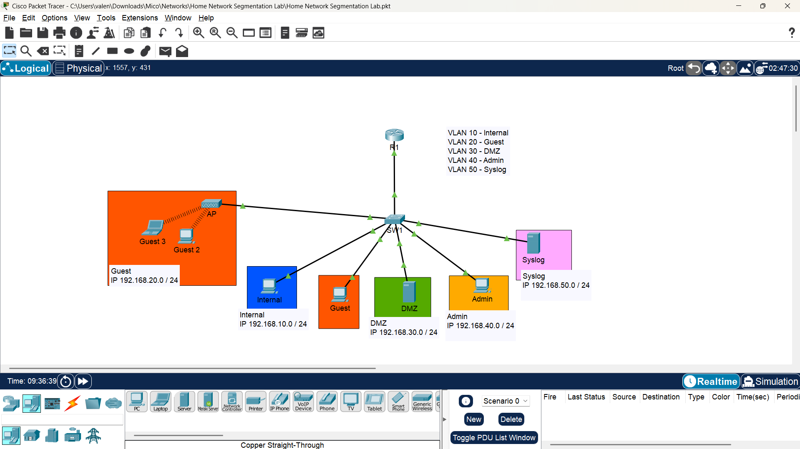
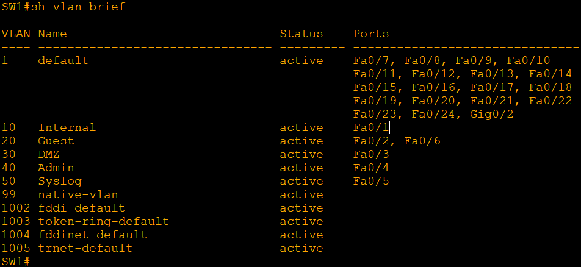
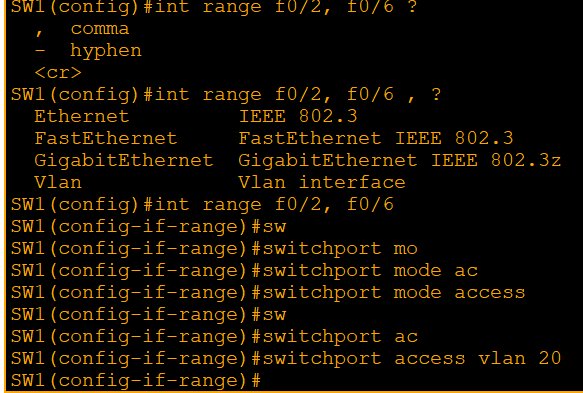

# Home-Network-Segmentation-Lab
Configured VLAN segmentation with inter-VLAN routing, DHCP, static IP servers, and ACLs to simulate a secure DMZ. The setup restricts guest access, limits internal users to web traffic (HTTP/HTTPS), and grants full access to admin PCs.

**Welcome to the Networking Lab Project to demonstrate VLAN, inter-VLAN routing DHCP, and ACL Configuration**

**To open this project lab: Download the .pkt file and open it using Cisco Packet Tracer.**
## Project Overview
A comprehensive Packet Tracer project demonstrating core networking concepts, including:  
- VLANs (Virtual Land Area Networks)  
- Inter-VLAN Routing  
- DHCP (Dynamic Host Configuration Protocol)   
- ACLs (Access Control Lists)

This project demonstrates the configuration of a segmented home network using VLANs and inter-VLAN routing. It includes DHCP configuration for guest and internal networks, static IP assignments for admin and server devices, and the implementation of ACLs to control network access. The setup ensures that guest users are isolated, internal users have limited access to servers (HTTP/HTTPS only), and admin PCs have full management access. The network design follows best practices for segmentation, access control, and secure communication between devices.


## Brief Description of the used concepts and the Roles they play in the network
1. **VLANs (Virtual land Area Networks)**
- **Purpose:** Segment a network into smaller, isolated segments (VLANs) to improve organization, security, and management.
- **Role:** VLANs act as separate networks, allowing devices within a VLAN to communicate with each other but not with devices in other VLANs without routing.

2. **Routing Configuration**
- **Purpose:** Enable communication between VLANs and other networks.
- **Role:** Routers connect multiple VLANs and networks, allowing devices to communicate with each other across different VLANs.

3. **DHCP (Dynamic Host Configuration Protocol) Configuration**
- **Purpose:** Automatically assign IP addresses to devices on a network.
- **Role:** DHCP servers assign IP addresses, subnet masks, default gateways, and other network settings to devices, eliminating the need for manual configuration.

4. **ACL (Access Control List) Configuration**
- **Purpose:** To enhance security by filtering traffic based on IP addresses, protocols, or ports, preventing unauthorized access and protecting sensitive areas of the network.
- **Role:** ACL act as a gatekeeper—managing and controlling the flow of data between different network segments to ensure that only permitted traffic can pass through.

  
## Tools used for this Lab
- Cisco Packet Tracer  
- Virtual Studio Code Terminal (for documentation editing)


## Network Topology
| Device | Quantity | Purpose |
|---------|--------|------------------|
|Router (Cisco 2911)| 1 | Inter-VLAN Routing, DHCP & ACLs Configurations |
|Switches (Cisco Catalyst 2960)| 1 | Connect end devices, assign VLANs, forward traffic to trunk uplinks
|Server PT | 2 | Server for HTTPS|
|Access Point | 1 | Connect end devies thru wireless|
|Personal Computers | 4 | End devices |
|Laptops | 1 | End devices |


## IP Address Scheme
| VLAN |	Subnet |	Gateway |	DHCP Range | Static IP | Purpose | 
|-----------------|----------------|--------------|---------------------|---------------------|---------------------|
|VLAN 10 (Internal)|192.168.10.0/24|192.168.10.1|	192.168.10.2 - 192.168.10.254|| Trusted devices|
|VLAN 20 (Guest)|	192.168.20.0/24|192.168.20.1|	192.168.20.2 - 192.168.20.254|| Guest devices|
|VLAN 30 (DMZ)|	192.168.30.0/24|	192.168.30.1|| 192.168.30.2| Public services|
|VLAN 40 (Admin)|	192.168.40.0/24|192.168.40.1|| 192.168.40.2| Trusted devices|
|VLAN 50 (Syslog)|	192.168.50.0/24|192.168.50.1|| 192.168.50.2| Monitoring/logging|

---
# Step-by-Step Configuration of the Simulated Network in Cisco Packet Tracer

## STEP 1: Network Design
### Open Cisco Packet Tracer and Set Up the Topology
- Launch Cisco Packet Tracer.
On the open blank space: 
- Click "End Devices" > click and drop 4 PC, 2 server, and 1 laptop into the setup 
- Click "Switches" under Networking devices > click and drop:
    - 1 Access Switches (2960-24TT)
- Click "Routers" under Networking devices> click and drop Router (2911)
- Click "Wireless Devices" under Networking devices> click and drop Access Point (PT)


## STEP 2: Physically connect the devices 
Use the “Connections” lightning icon on the left:
Choose "first cable" to automatically choose connection type for the devices (Switches and end devices connection) 

**Connect:**
Each PC to a port on an Access Switch 
   - Internal PC (Fa0) to Switch 1 (Fa0/1) 
   - Guest PC (Fa0) to Switch 1 (Fa0/2)
   - DMZ Server (Fa0) to Switch 1 (Fa0/3)
   - Admin PC (Fa0) to Switch 1 (Fa0/4)
   - Syslog Server (Fa0) to Switch 1 (Fa0/5)
   - Access Point (Fa0) to Switch 1 (Fa0/6)

**Connect:** 
Switch 1 to the Router using a copper straight-through cable 
   - Router - (Gig0/0) to Switch 1  - (Gig0/1)

## STEP 3: Turn on the Switches 
 - Click on the Switch 

## STEP 4: Create VLANs and assign ports on the Switches 
### i. Create VLAN 10, 20, 30, 40, and 50 on Switch 1


- click on the Switch 1 device
- enter into the CLI

```bash
Switch 1# configure terminal
Switch 1(config)# vlan 10
Switch 1(config-vlan)# name Internal
Switch 1(config)# vlan 20
Switch 1(config-vlan)# name Guest
Switch 1(config)# vlan 30
Switch 1(config-vlan)# name DMZ
Switch 1(config)# vlan 40
Switch 1(config-vlan)# name Admin
Switch 1(config)# vlan 50
Switch 1(config-vlan)# name Syslog
Switch 1(config-vlan)# exit
```

### Assign Ports to VLAN 10,20,30,40, and 50 

```bash
Switch 1# configure terminal
Switch 1(config)# int range fa0/1
Switch 1(config-if)# switchport mode access
Switch 1(config-if)# switchport access vlan 10
Switch 1(config-if)#
Switch 1(config-if)# int range fa0/2, fa0/6
Switch 1(config-if-range)# switchport mode access
Switch 1(config-if-range)# switchport access vlan 20
Switch 1(config-if-range)#
Switch 1(config-if-range)# int fa0/3
Switch 1(config-if)# switchport mode access
Switch 1(config-if)# switchport access vlan 30
Switch 1(config-if)#
Switch 1(config-if)# int f0/4
Switch 1(config-if)# switchport mode access
Switch 1(config-if)# switchport access vlan 40
Switch 1(config-if)# 
Switch 1(config-if)# int f0/5
Switch 1(config-if)# switchport mode access
Switch 1(config-if)# switchport access vlan 50
Switch 1(config-if)# exit
```


